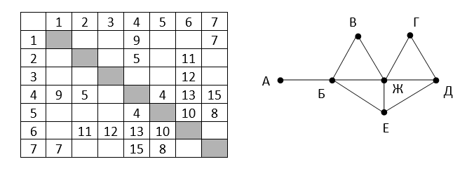

# Java решения заданий ЕГЭ

Объяснения лежат [здесь](https://ege.buran.rest)

Задания взяты с [сайта Константина Полякова](https://kpolyakov.spb.ru/school/ege.htm).

[С++ Исходники решений](https://github.com/aoklyunin/ege-cpp)

[Python Исходники решений](https://github.com/aoklyunin/ege-py)

## Задание 1

### Пример 1

(№ 4145) (Е. Джобс) На рисунке справа схема дорог Н-ского района изображена в виде графа, в
таблице содержатся сведения о длинах этих дорог (в километрах).
Так как таблицу и схему рисовали независимо друг от друга, то нумерация населённых пунктов
в таблице никак не связана с буквенными обозначениями на графе. В таблице в левом столбце
указаны номера пунктов, откуда совершается движение, в первой строке – куда. Определите
длину дороги между пунктами А и Б, если известно, что длина дороги между Г и Д меньше длины
дороги между Г и Е. Передвигаться можно только по указанным дорогам.

Ответ: 10

[Исходник](https://github.com/aoklyunin/ege-java/blob/master/src/main/java/problem1/Example1.java)

### Пример 2

Р-09. На рисунке справа схема дорог Н-ского района изображена в виде графа, в таблице
содержатся сведения о длинах этих дорог (в километрах). Так как таблицу и схему рисовали 
независимо друг от друга, то нумерация населённых пунктов в таблице никак не связана с
буквенными обозначениями на графе. Известно, что длина кратчайшего пути из пункта А в
пункт Ж не больше 15. Определите, какова длина кратчайшего пути из пункта Д в пункт В. 
В ответе запишите целое число – так, как оно указано в таблице.

Ответ: 19

[Исходник](https://github.com/aoklyunin/ege-java/blob/master/src/main/java/problem1/Example2.java)

### Пример 3

Р-10 (демо-2021). На рисунке справа схема дорог Н-ского района изображена в виде
графа, в таблице содержатся сведения о длинах этих дорог (в километрах).
Так как таблицу и схему рисовали независимо друг от друга, то нумерация населённых
пунктов в таблице никак не связана с буквенными обозначениями на графе. Определите,
какова протяжённость дороги из пункта Г в пункт Ж. В ответе запишите целое число –
так, как оно указано в таблице.

Ответ: 9

[Исходник](https://github.com/aoklyunin/ege-java/blob/master/src/main/java/problem1/Example3.java)

### Пример 4

На рисунке справа схема дорог Н-ского района изображена в виде графа, в таблице содержатся 
сведения о длинах этих дорог (в километрах). Так как таблицу и схему рисовали независимо 
друг от друга, то нумерация населённых пунктов в таблице никак не связана с буквенными 
обозначениями на графе. Определите, какова длина дороги из пункта В в пункт Е. 
В ответе запишите целое число – так, как оно указано в таблице.

Ответ: 20

[Исходник](https://github.com/aoklyunin/ege-java/blob/master/src/main/java/problem1/Example4.java)

### Пример 5

На рисунке справа схема дорог Н-ского района изображена в виде графа, в таблице содержатся
сведения о длинах этих дорог (в километрах). Так как таблицу и схему рисовали независимо друг
от друга, то нумерация населённых пунктов в таблице никак не связана с буквенными
обозначениями на графе. Определите, какова длина дороги из пункта А в пункт Д. В ответе
запишите целое число – так, как оно указано в таблице.

Ответ: 46

[Исходник](https://github.com/aoklyunin/ege-java/blob/master/src/main/java/problem1/Example5.java)

### Пример 6

Между населёнными пунктами A, B, C, D, E, F построены дороги, протяжённость которых приведена
в таблице. (Отсутствие числа в таблице означает, что прямой дороги между пунктами нет.)
Определите длину кратчайшего пути между пунктами A и F, проходящего через пункт E и не 
проходящего через пункт B. Передвигаться можно только по указанным дорогам.

Ответ: 17

[Исходник](https://github.com/aoklyunin/ege-java/blob/master/src/main/java/problem1/Example6.java)

### Пример 7

Между населёнными пунктами A, B, C, D, E, F, Z построены дороги с односторонним движением. 
В таблице указана протяжённость каждой дороги. Отсутствие числа в таблице означает, 
что прямой дороги между пунктами нет. Например, из A в B есть дорога длиной 4 км, а из
B в A дороги нет.

Сколько существует таких маршрутов из A в Z, которые проходят через 6 и более населен-ных
пунктов? Пункты A и Z при подсчете учитывать. Два раза проходить через один пункт нельзя.

Ответ: 6

[Исходник](https://github.com/aoklyunin/ege-java/blob/master/src/main/java/problem1/Example7.java)

### Пример 8

Р-04. Между населёнными пунктами A, B, C, D, E, F, G построены дороги, протяжённость 
которых приведена в таблице. (Отсутствие числа в таблице означает, что прямой дороги между
пунктами нет.)

Определите длину кратчайшего пути между пунктами A и G (при условии, что
передвигаться можно только по построенным дорогам).

Ответ: 23

[Исходник](https://github.com/aoklyunin/ege-java/blob/master/src/main/java/problem1/Example8.java)

### Пример 9

Р-03. Между населёнными пунктами A, B, C, D, E, F построены дороги, протяжённость которых
приведена в таблице. (Отсутствие числа в таблице означает, что прямой дороги между
пунктами нет.)

Определите длину кратчайшего пути между пунктами A и F (при условии, что передвигаться 
можно только по построенным дорогам).

Ответ: 9

[Исходник](https://github.com/aoklyunin/ege-java/blob/master/src/main/java/problem1/Example9.java)

[Задания для самостоятельного выполнения](problems/problem1/exercises.pdf)

